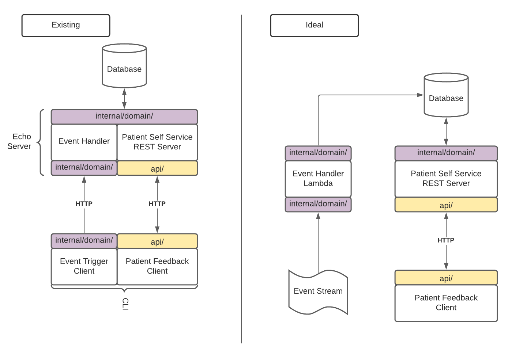
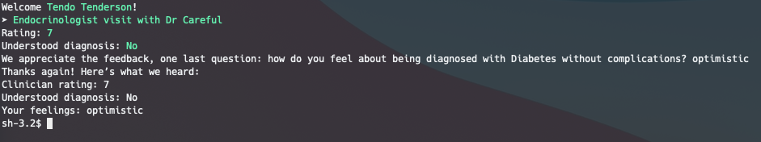

# Patient Feedback Client and Server

## Diagrams 

### Object Model


### Service Architecture


## Patient Self Service Server

### Provided Endpoints

`GET /patients/` - returns a list of all patients

`GET /patients/<patientId>` - returns data for the patient with the provided ID

`GET /patients/<patientId>/appointments` - returns all appointments in the system for the patient

`GET /appointments/<appointmentId>` - returns data for the appointment with the provided ID

`GET /appointments/<appointmentId>/feedback` - returns all feedback submitted for the appointment

`POST /appointments/<appointmentId>/feedback` - creates a new feedback item for the appointment

`GET /secured/dumpdb` - dumps database contents to JSON output

`POST /secured/bundle` - loads server database with data from a resource bundle

### Running the Server

Running the server is simple, just run the following command:
```
go run cmd/server/main.go
```

### Running the CLI Client

In order to seed the server with data, we need to first simulate a bundle being sent. The server is handling this with an HTTP
request handler. We can verify that the database on the server is empty by hitting a special endpoint to view the database contents

```
curl http://localhost:1323/secured/dumpdb
```

The result should be the following:

```json
{"appointments":null,"diagnoses":null,"doctors":null,"feedback":null,"patients":null}
```

Now we can seed the data by running our CLI with the `triggerEvent` command and providing a file with the bundle format provided.

```
go run cmd/client/main.go triggerEvent data/bundle.json
```

Running the `dumpdb` request again will show that the database has been populated.

Now we'll run the CLI as though we are a user and would like to leave feedback.

```
go run cmd/client/main.go feedback
```

Follow the prompts to provide feedback and have the data sent back to the server to be saved.

Running the `dumpdb` command will show you the full state of the database or you can hit `/appointments/<id>/feedback` REST endpoint to view the feedback item as it is saved in the system

### Demo Screenshots





## Libraries Used

* Echo - Lightweight http server used for routing.
* Cobra - Easy command line arg parsing and command setting
* Promptui - Small library for making prompts prettier and constraining input
    * This was a new library used. Pretty happy with how simple it was to get something up and running. Found a few limitations that made fine control of experience.

## Future possible enhancements

* Implement proper DB with Node4J or a RelationalDB
* Asynchronous processing where `Bundle` could be used as an event to seed data from another service
* Configurable surveys where the input questions and response types could be added or modified without compiling into binary
* Process input with conditional branches based on input.
  * e.g. Asking for elaboration if rating of a clinician is low